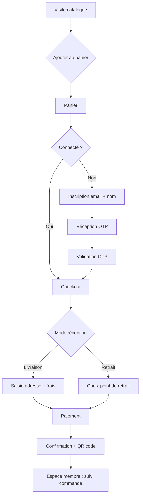
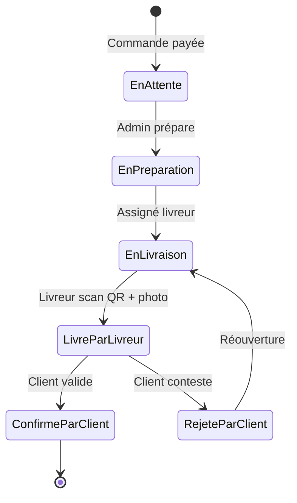
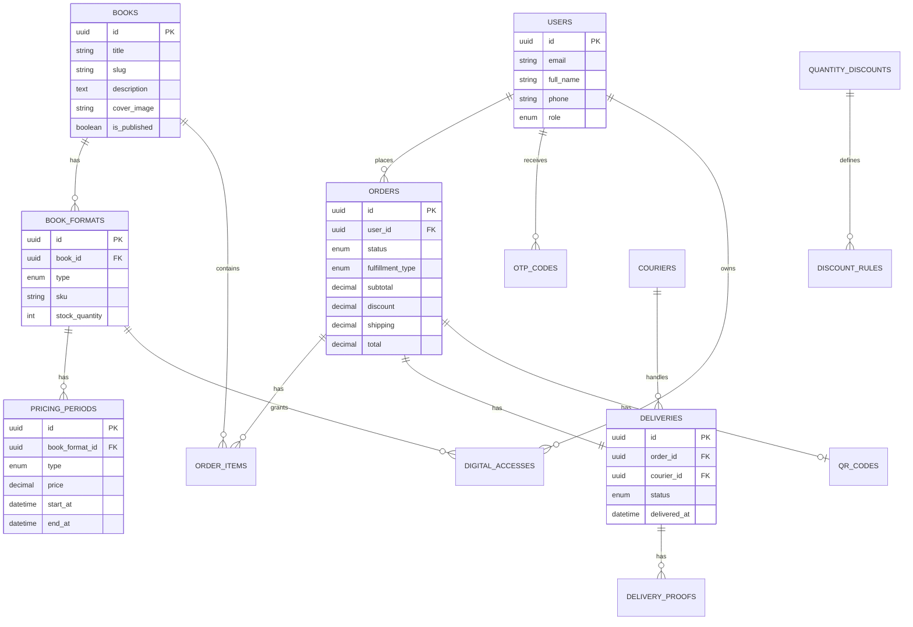
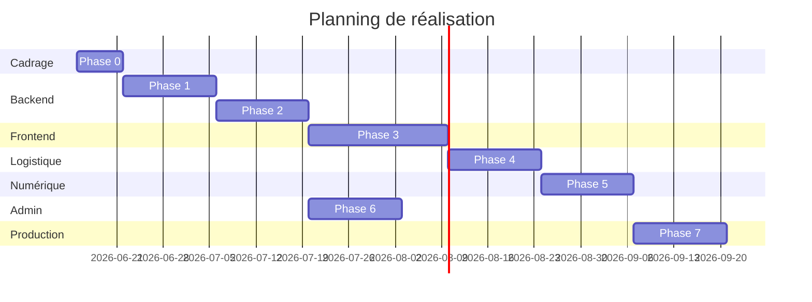

# Ken Luamba — Plateforme de pré-commande et vente de livres

Site officiel du pasteur Ken Luamba : plateforme e-commerce pour la pré-commande, la vente et la distribution de ses ouvrages (formats physiques, audio et ebook).

---

## Organisation Git — 2 branches de déploiement

Le projet est séparé en **deux branches indépendantes** pour faciliter le déploiement sur Hostinger (backend et frontend sur des hébergements distincts).

| Branche | Contenu | Déploiement Hostinger |
|---------|---------|----------------------|
| `backend-filament-api` | Laravel 13 + Filament 5 + API Sanctum **à la racine** | `api.kenluamba.com` → `public/` |
| `frontend-nextjs` | Next.js 16 **à la racine** | `www.kenluamba.com` → Node.js |
| `main` | Cahier des charges + monorepo local (`backend/` + `frontend/`) | Documentation |

### Cloner pour déploiement

```bash
# Backend (API + back-office Filament)
git clone -b backend-filament-api <url-du-repo> ken-luamba-api
cd ken-luamba-api
composer install --no-dev
cp .env.example .env && php artisan key:generate && php artisan migrate --force

# Frontend (boutique Next.js)
git clone -b frontend-nextjs <url-du-repo> ken-luamba-web
cd ken-luamba-web
npm install && npm run build
```

### Développement local (branche main)

```bash
# Terminal 1 — Backend
cd backend
composer install
cp .env.example .env
php artisan key:generate
php artisan migrate
php artisan serve

# Terminal 2 — Frontend
cd frontend
npm install
cp .env.example .env.local
npm run dev
```

| Service | URL locale |
|---------|------------|
| API | http://localhost:8001/api/v1/health |
| Back-office Filament | http://localhost:8001/admin |
| Boutique Next.js | http://localhost:3001 |

### Recréer les branches de déploiement

```powershell
powershell -ExecutionPolicy Bypass -File scripts/setup-branches.ps1
```

Documentation détaillée par projet :
- Backend → [`backend/README.md`](backend/README.md)
- Frontend → [`frontend/README.md`](frontend/README.md)

---

## Table des matières

1. [Contexte et objectifs](#1-contexte-et-objectifs)
2. [Périmètre fonctionnel](#2-périmètre-fonctionnel)
3. [Acteurs et rôles](#3-acteurs-et-rôles)
4. [Parcours utilisateurs](#4-parcours-utilisateurs)
5. [Spécifications détaillées](#5-spécifications-détaillées)
6. [Architecture technique](#6-architecture-technique)
7. [Structure du projet](#7-structure-du-projet)
8. [Modèle de données](#8-modèle-de-données)
9. [API REST](#9-api-rest)
10. [Sécurité et conformité](#10-sécurité-et-conformité)
11. [Intégrations tierces](#11-intégrations-tierces)
12. [Back-office Filament](#12-back-office-filament)
13. [Frontend Next.js](#13-frontend-nextjs)
14. [Plan de réalisation par phases](#14-plan-de-réalisation-par-phases)
15. [Livrables et critères d'acceptation](#15-livrables-et-critères-dacceptation)
16. [Estimation et ressources](#16-estimation-et-ressources)

---

## 1. Contexte et objectifs

### 1.1 Contexte

Le pasteur Ken Luamba publie des ouvrages destinés à un large public. La plateforme doit permettre :

- La **pré-commande** pendant des fenêtres temporelles avec tarifs dédiés
- La **vente en ligne** avec panier e-commerce classique
- La **livraison** ou le **retrait sur place** via QR code
- L'accès aux **formats numériques** (ebook, audio) avec protection anti-redistribution
- La **gestion opérationnelle** complète depuis un back-office central

### 1.2 Objectifs métier

| Objectif | Indicateur de succès |
|----------|---------------------|
| Maximiser les pré-commandes | Taux de conversion pré-commande > 5 % |
| Simplifier l'achat | Inscription + achat en moins de 3 minutes |
| Fiabiliser la logistique | Taux de litiges livraison < 2 % |
| Protéger le contenu numérique | Aucune fuite massive de fichiers |
| Piloter l'activité | Rapports exportables (PDF/Excel) par période |

### 1.3 Hors périmètre (v1)

- Application mobile native (le site sera responsive)
- Marketplace multi-auteurs
- Abonnement récurrent / club de lecture
- Traduction multilingue (prévoir l'architecture i18n pour v2)

---

## 2. Périmètre fonctionnel

### 2.1 Synthèse des modules

```
┌─────────────────────────────────────────────────────────────────┐
│                     FRONTEND NEXT.JS (Client)                   │
│  Catalogue │ Panier │ Checkout │ Espace membre │ Ebook/Audio   │
└────────────────────────────┬────────────────────────────────────┘
                             │ API REST (Laravel Sanctum)
┌────────────────────────────▼────────────────────────────────────┐
│                    BACKEND LARAVEL + API                        │
│  Auth OTP │ Commandes │ Paiements │ QR │ DRM léger │ Notifications│
└────────────────────────────┬────────────────────────────────────┘
                             │
┌────────────────────────────▼────────────────────────────────────┐
│                  BACK-OFFICE FILAMENT (Admin)                   │
│  Livres │ Tarifs │ Promos │ Clients │ Livreurs │ Rapports       │
└─────────────────────────────────────────────────────────────────┘
                             │
┌────────────────────────────▼────────────────────────────────────┐
│              ESPACE LIVREUR (Filament Panel ou PWA)             │
│  Scan QR │ Validation livraison │ Photo preuve                  │
└─────────────────────────────────────────────────────────────────┘
```

### 2.2 Fonctionnalités par module

| # | Module | Description |
|---|--------|-------------|
| F1 | Catalogue & panier | Affichage livres, formats, prix dynamiques, panier persistant |
| F2 | Pré-commande & vente | Fenêtres temporelles, tarifs par période, passage automatique en vente |
| F3 | Tarification & réductions | Remises par quantité configurables dans le dashboard |
| F4 | Authentification OTP | Inscription email + nom, connexion par code à usage unique |
| F5 | Formats multiples | Broché/relie, audio, ebook avec accès sécurisé |
| F6 | Livraison & retrait | Choix livraison/retrait, QR code unique par commande |
| F7 | Espace livreur | Validation livraison, photo preuve, workflow client |
| F8 | Back-office | Paramétrage central, gestion, rapports |
| F9 | Espace membre | Historique achats, accès contenus, suivi commandes |
| F10 | Paiement | Intégration passerelle locale (Mobile Money, carte) |

---

## 3. Acteurs et rôles

| Rôle | Accès | Permissions principales |
|------|-------|-------------------------|
| **Visiteur** | Site public | Consulter catalogue, ajouter au panier |
| **Client** | Espace membre | Acheter, pré-commander, accéder aux ebooks/audio, valider réception |
| **Livreur** | Espace livreur | Scanner QR, confirmer livraison, joindre photo |
| **Éditeur / Modérateur** | Back-office partiel | Gérer livres, contenus auteur, pas les finances |
| **Administrateur** | Back-office complet | Tout paramétrer, rapports, utilisateurs, tarifs |
| **Super Admin** | Système | Configuration technique, intégrations, logs |

### 3.1 Matrice des permissions (résumé)

| Action | Client | Livreur | Éditeur | Admin |
|--------|--------|---------|---------|-------|
| Acheter / pré-commander | ✅ | ❌ | ❌ | ❌ |
| Télécharger ebook/audio | ✅ (ses achats) | ❌ | ❌ | ❌ |
| Valider réception | ✅ | ❌ | ❌ | ❌ |
| Scanner QR & livrer | ❌ | ✅ | ❌ | ❌ |
| Créer / modifier livre | ❌ | ❌ | ✅ | ✅ |
| Définir tarifs & promos | ❌ | ❌ | ❌ | ✅ |
| Voir rapports financiers | ❌ | ❌ | ❌ | ✅ |

---

## 4. Parcours utilisateurs

### 4.1 Parcours achat (client)



### 4.2 Parcours livraison



### 4.3 Parcours retrait sur place

1. Client paie et reçoit un **QR code** (email + espace membre)
2. Client se présente au point de retrait avec le QR
3. Agent / livreur scanne le QR → statut **« Retiré »**
4. Pour formats numériques : accès immédiat dans l'espace membre après paiement

---

## 5. Spécifications détaillées

### 5.1 Pré-commande et vente par période

Chaque livre (ou édition) peut avoir plusieurs **périodes tarifaires** :

| Champ | Type | Description |
|-------|------|-------------|
| `label` | string | Ex. « Pré-commande early bird » |
| `type` | enum | `preorder`, `regular`, `promo` |
| `start_at` | datetime | Début de la période |
| `end_at` | datetime | Fin de la période |
| `price` | decimal | Prix pour cette période |
| `format_id` | FK | Format concerné (relié, ebook, audio…) |
| `is_active` | boolean | Activation manuelle possible |

**Règles métier :**

- Le prix affiché = période active à l'instant T (sinon prochaine période ou indisponible)
- À la fin d'une pré-commande, transition automatique vers la période suivante (configurable)
- Le panier recalcule les prix si la période expire avant paiement (avec alerte utilisateur)

### 5.2 Système de réductions par quantité

Configurable dans le dashboard par **règle de remise** :

| Champ | Description |
|-------|-------------|
| `min_quantity` | Quantité minimale (ex. 3 livres) |
| `discount_type` | `percentage` ou `fixed_amount` |
| `discount_value` | Valeur de la remise |
| `applies_to` | `all_books`, `specific_book`, `category` |
| `stackable` | Cumulable avec code promo ou non |
| `valid_from` / `valid_until` | Fenêtre de validité |

**Exemple :** 3 livres = -10 %, 5 livres = -15 %, 10 livres = -20 %.

Le calcul s'applique sur le **nombre total de livres physiques** du panier (les règles ebook/audio peuvent être distinctes).

### 5.3 Authentification OTP (sans mot de passe)

**Inscription :**

1. Email + nom complet (champs obligatoires)
2. Téléphone optionnel (recommandé pour notifications SMS)
3. Envoi OTP par email (6 chiffres, validité 10 min)
4. Création compte après validation OTP

**Connexion :**

1. Saisie email
2. Envoi OTP
3. Validation → token Sanctum (session API)

**Sécurité :**

- Limite : 5 tentatives OTP / heure / email
- Token refresh et révocation depuis l'espace membre
- Pas de mot de passe en v1 (réduit la friction)

### 5.4 Formats de livre

| Format | Code | Livraison | Accès numérique | Anti-redistribution |
|--------|------|-----------|-----------------|---------------------|
| Broché | `paperback` | Oui | — | — |
| Relié / couverture rigide | `hardcover` | Oui | — | — |
| Ebook | `ebook` | Non | Lecteur web intégré | Filigrane + lien signé + pas de téléchargement brut |
| Audio | `audiobook` | Non | Streaming sécurisé | Lien signé temporaire, pas de MP3 direct |

**Protection ebook (v1 — DRM léger) :**

- Lecture uniquement dans l'espace membre (lecteur PDF/EPUB custom ou solution type Foliate.js)
- Filigrane visible : email + ID commande sur chaque page
- URLs de streaming signées (expiration 2 h, renouvelables)
- Pas de bouton « Télécharger » en v1
- Logs d'accès consultables en back-office

**Protection audio (v1) :**

- Streaming HLS avec segments chiffrés ou URLs signées
- Pas de lien direct vers fichier source

### 5.5 QR code — livraison et retrait

**Génération :**

- Un QR unique par commande (ou par ligne de commande physique si besoin)
- Contenu : token signé UUID (pas d'infos client en clair)
- Format : PNG + PDF imprimable
- Envoi : email confirmation + espace membre

**Utilisation :**

- Livreur scanne via espace livreur (caméra mobile)
- Vérification API → affichage résumé commande (nom client, adresse, articles)
- Action : « Marquer comme livré » + photo optionnelle/obligatoire (paramétrable)

### 5.6 Workflow livraison — double validation

| Étape | Acteur | Action | Statut résultant |
|-------|--------|--------|------------------|
| 1 | Système | Paiement confirmé | `paid` |
| 2 | Admin | Préparation | `processing` |
| 3 | Admin | Assignation livreur | `out_for_delivery` |
| 4 | Livreur | Scan QR + photo | `delivered_by_courier` |
| 5a | Client | Confirme réception | `completed` |
| 5b | Client | Rejette (« pas reçu ») | `delivery_disputed` |

En cas de litige : notification admin, historique horodaté, photo livreur consultable.

### 5.7 Panier e-commerce

Fonctionnalités standard :

- Ajout / suppression / modification quantités
- Persistance : localStorage (invité) + sync API (connecté)
- Récapitulatif : sous-total, remises, frais livraison, total
- Codes promo optionnels (v2 ou v1 si temps)
- Abandon de panier tracké (rapport admin)

### 5.8 Contenu auteur & pages institutionnelles

Gérés via back-office (CMS léger) :

- Biographie du pasteur Ken Luamba
- Page « À propos »
- Galerie / médias
- FAQ
- Conditions générales de vente
- Politique de confidentialité
- Points de retrait (adresses, horaires)

---

## 6. Architecture technique

### 6.1 Stack retenue

| Couche | Technologie | Justification |
|--------|-------------|---------------|
| **Back-office** | Laravel 13 + Filament 5 | CRUD rapide, rôles, widgets, rapports |
| **API** | Laravel (même projet) | Sanctum, queues, events, cohérence métier |
| **Frontend client** | Next.js 16 (App Router) | SSR/SSG SEO, performances, UX e-commerce |
| **Base de données** | PostgreSQL | Fiabilité, JSON, full-text search |
| **Cache / Queues** | Redis | Sessions, OTP, jobs async |
| **Stockage fichiers** | S3-compatible (ou local dev) | Ebooks, audio, photos livraison |
| **Recherche** | Laravel Scout + Meilisearch (optionnel) | Catalogue |

### 6.2 Schéma d'architecture

```
                    ┌──────────────┐
                    │   Vercel     │
                    │  (Next.js)   │
                    └──────┬───────┘
                           │ HTTPS
                    ┌──────▼───────┐
                    │   CDN / LB   │
                    └──────┬───────┘
          ┌────────────────┼────────────────┐
          │                │                │
   ┌──────▼──────┐  ┌──────▼──────┐  ┌──────▼──────┐
   │  Next.js    │  │  Laravel    │  │  Laravel    │
   │  (SSR/SSG)  │  │  API        │  │  Filament   │
   └─────────────┘  └──────┬──────┘  └─────────────┘
                           │
              ┌────────────┼────────────┐
              │            │            │
       ┌──────▼───┐ ┌──────▼───┐ ┌──────▼───┐
       │PostgreSQL│ │  Redis   │ │ S3/Minio │
       └──────────┘ └──────────┘ └──────────┘
```

### 6.3 Communication Frontend ↔ API

- **Authentification :** Laravel Sanctum (tokens SPA ou cookies selon déploiement)
- **Format :** JSON REST, versioning `/api/v1/`
- **Documentation :** OpenAPI (Swagger) générée via Scramble ou L5-Swagger
- **Temps réel (optionnel v2) :** Laravel Reverb / Pusher pour statut commande

### 6.4 Avantages Next.js pour ce projet

| Fonctionnalité Next.js | Usage projet |
|------------------------|--------------|
| **SSR / SSG** | Pages catalogue et auteur indexées SEO |
| **ISR** | Mise à jour catalogue sans rebuild complet |
| **App Router** | Layouts partagés (header, panier, footer) |
| **Server Components** | Réduction bundle client, chargement rapide |
| **Route Handlers** | BFF léger si besoin (proxy paiement) |
| **Image Optimization** | Couvertures livres optimisées |
| **Middleware** | Protection routes espace membre |

---

## 7. Structure du projet

### 7.1 Organisation monorepo recommandée

```
ken-luamba/
├── README.md                    # Ce document
├── docker-compose.yml           # Dev : PostgreSQL, Redis, Minio, Mailpit
├── .github/
│   └── workflows/               # CI/CD
│
├── backend/                     # Laravel + Filament + API
│   ├── app/
│   │   ├── Filament/            # Resources, Pages, Widgets admin
│   │   │   ├── Resources/
│   │   │   │   ├── BookResource.php
│   │   │   │   ├── OrderResource.php
│   │   │   │   ├── CustomerResource.php
│   │   │   │   ├── CourierResource.php
│   │   │   │   ├── PricingPeriodResource.php
│   │   │   │   ├── QuantityDiscountResource.php
│   │   │   │   └── ...
│   │   │   ├── Pages/
│   │   │   │   ├── Dashboard.php
│   │   │   │   └── Reports.php
│   │   │   └── Widgets/
│   │   │       ├── SalesOverview.php
│   │   │       └── OrdersChart.php
│   │   ├── Filament/Courier/    # Panel séparé livreurs (optionnel)
│   │   ├── Http/
│   │   │   ├── Controllers/Api/V1/
│   │   │   └── Requests/
│   │   ├── Models/
│   │   ├── Services/
│   │   │   ├── CartService.php
│   │   │   ├── OrderService.php
│   │   │   ├── OtpService.php
│   │   │   ├── QrCodeService.php
│   │   │   ├── PricingService.php
│   │   │   ├── DiscountService.php
│   │   │   ├── DigitalAccessService.php
│   │   │   └── DeliveryService.php
│   │   ├── Enums/
│   │   └── Policies/
│   ├── database/
│   │   ├── migrations/
│   │   └── seeders/
│   ├── routes/
│   │   ├── api.php
│   │   └── web.php
│   └── tests/
│
└── frontend/                    # Next.js
    ├── app/
    │   ├── (shop)/              # Boutique publique
    │   │   ├── page.tsx         # Accueil
    │   │   ├── livres/
    │   │   │   ├── page.tsx     # Catalogue
    │   │   │   └── [slug]/page.tsx
    │   │   ├── panier/page.tsx
    │   │   ├── checkout/page.tsx
    │   │   └── auteur/page.tsx
    │   ├── (auth)/
    │   │   ├── connexion/page.tsx
    │   │   └── inscription/page.tsx
    │   ├── (member)/            # Espace membre (protégé)
    │   │   ├── mes-commandes/
    │   │   ├── mes-livres/      # Ebook / audio
    │   │   └── profil/
    │   └── (courier)/           # Espace livreur (protégé)
    │       ├── livraisons/
    │       └── scan/
    ├── components/
    │   ├── shop/
    │   ├── cart/
    │   ├── checkout/
    │   └── reader/              # Lecteur ebook
    ├── lib/
    │   ├── api/                 # Client API typé
    │   └── hooks/
    └── types/
```

### 7.2 Panels Filament

| Panel | URL | Utilisateurs |
|-------|-----|--------------|
| Admin | `/admin` | Admin, Éditeur |
| Courier | `/courier` | Livreurs |

---

## 8. Modèle de données

### 8.1 Diagramme entité-relation (simplifié)



### 8.2 Tables principales

| Table | Rôle |
|-------|------|
| `users` | Clients, livreurs, admins (rôle via enum ou Spatie Permission) |
| `books` | Ouvrages |
| `book_formats` | Formats par livre (relié, ebook…) |
| `pricing_periods` | Tarifs par période |
| `quantity_discounts` | Règles de remise globales |
| `carts` / `cart_items` | Paniers (DB pour utilisateurs connectés) |
| `orders` / `order_items` | Commandes |
| `payments` | Transactions paiement |
| `qr_codes` | Tokens QR par commande |
| `deliveries` | Suivi livraison |
| `delivery_proofs` | Photos preuve |
| `pickup_points` | Points de retrait |
| `digital_accesses` | Droits d'accès ebook/audio |
| `digital_access_logs` | Audit lecture |
| `otp_codes` | Codes OTP temporaires |
| `cms_pages` | Contenus statiques |
| `settings` | Paramètres globaux (frais livraison, etc.) |

### 8.3 Statuts commande (`orders.status`)

```
draft → pending_payment → paid → processing → out_for_delivery
  → delivered_by_courier → completed
  → delivery_disputed (branche litige)
  → cancelled / refunded
```

---

## 9. API REST

### 9.1 Endpoints principaux (v1)

#### Auth

| Méthode | Endpoint | Description |
|---------|----------|-------------|
| POST | `/api/v1/auth/register` | Inscription (email, nom) → envoi OTP |
| POST | `/api/v1/auth/verify-otp` | Validation OTP → token |
| POST | `/api/v1/auth/login` | Demande OTP connexion |
| POST | `/api/v1/auth/logout` | Révocation token |
| GET | `/api/v1/auth/me` | Profil connecté |

#### Catalogue

| Méthode | Endpoint | Description |
|---------|----------|-------------|
| GET | `/api/v1/books` | Liste livres (filtres, pagination) |
| GET | `/api/v1/books/{slug}` | Détail livre + formats + prix actuels |
| GET | `/api/v1/pricing/current` | Prix actifs par format |

#### Panier

| Méthode | Endpoint | Description |
|---------|----------|-------------|
| GET | `/api/v1/cart` | Récupérer panier |
| POST | `/api/v1/cart/items` | Ajouter article |
| PATCH | `/api/v1/cart/items/{id}` | Modifier quantité |
| DELETE | `/api/v1/cart/items/{id}` | Supprimer article |
| POST | `/api/v1/cart/calculate` | Recalcul remises + total |

#### Commandes

| Méthode | Endpoint | Description |
|---------|----------|-------------|
| POST | `/api/v1/orders` | Créer commande depuis panier |
| GET | `/api/v1/orders` | Mes commandes |
| GET | `/api/v1/orders/{id}` | Détail + QR + statut |
| POST | `/api/v1/orders/{id}/confirm-receipt` | Client confirme réception |
| POST | `/api/v1/orders/{id}/dispute-delivery` | Client conteste |

#### Paiement

| Méthode | Endpoint | Description |
|---------|----------|-------------|
| POST | `/api/v1/payments/initiate` | Initier paiement |
| POST | `/api/v1/payments/webhook` | Webhook passerelle |

#### Contenus numériques

| Méthode | Endpoint | Description |
|---------|----------|-------------|
| GET | `/api/v1/library` | Mes livres numériques |
| GET | `/api/v1/library/{id}/stream` | URL signée lecture/stream |

#### Livreur

| Méthode | Endpoint | Description |
|---------|----------|-------------|
| POST | `/api/v1/courier/scan` | Scanner QR → infos commande |
| POST | `/api/v1/courier/deliveries/{id}/confirm` | Confirmer livraison + upload photo |
| GET | `/api/v1/courier/deliveries` | Liste livraisons assignées |

#### CMS

| Méthode | Endpoint | Description |
|---------|----------|-------------|
| GET | `/api/v1/pages/{slug}` | Page statique |
| GET | `/api/v1/settings/public` | Paramètres publics |

---

## 10. Sécurité et conformité

| Domaine | Mesure |
|---------|--------|
| Authentification | OTP rate limiting, tokens Sanctum révocables |
| API | HTTPS obligatoire, CORS restrictif, validation Form Requests |
| Fichiers numériques | URLs signées, pas d'exposition bucket public |
| QR codes | Tokens signés, usage unique ou horodaté |
| RGPD / données perso | Consentement, droit suppression, export données |
| Paiement | PCI-DSS délégué à la passerelle (pas de stockage CB) |
| Uploads | Validation MIME, taille max, stockage privé |
| Audit | Logs actions admin et livreurs |

---

## 11. Intégrations tierces

| Service | Usage | Candidats |
|---------|-------|-----------|
| **Paiement** | Mobile Money + carte | Stripe, Flutterwave, CinetPay, pawaPay |
| **Email** | OTP, confirmations | Resend, Mailgun, Amazon SES |
| **SMS (optionnel)** | OTP, notifications livraison | Twilio, Africa's Talking |
| **Stockage** | Ebooks, audio, photos | AWS S3, Cloudflare R2 |
| **QR** | Génération | `simplesoftwareio/simple-qrcode` (Laravel) |
| **PDF factures** | Reçus commande | Laravel DomPDF / Snappy |

---

## 12. Back-office Filament

### 12.1 Resources à implémenter

| Resource | Fonctions clés |
|----------|----------------|
| **BookResource** | CRUD livre, formats, stock, publication |
| **PricingPeriodResource** | Périodes pré-commande / vente par format |
| **QuantityDiscountResource** | Règles remise par quantité |
| **OrderResource** | Liste, détail, changement statut, remboursement |
| **CustomerResource** | Clients, historique achats, accès numériques |
| **CourierResource** | Livreurs, assignations |
| **DeliveryResource** | Suivi, litiges, photos |
| **PaymentResource** | Transactions, rapprochement |
| **PickupPointResource** | Points de retrait |
| **CmsPageResource** | Pages auteur, légales, FAQ |
| **SettingResource** | Frais livraison, config OTP, délais |

### 12.2 Dashboard & rapports

**Widgets tableau de bord :**

- Chiffre d'affaires (jour / semaine / mois)
- Commandes en cours par statut
- Top livres vendus
- Taux conversion pré-commande

**Page Rapports (export PDF / Excel) :**

- Ventes par période
- Ventes par livre / format
- Performance pré-commandes vs vente régulière
- Remises appliquées
- Performance livreurs (délais, litiges)
- Accès contenus numériques

**Filtres rapport :** date début/fin, livre, format, statut, livreur.

---

## 13. Frontend Next.js

### 13.1 Pages principales

| Route | Type | Description |
|-------|------|-------------|
| `/` | SSG | Accueil, livres à la une, CTA pré-commande |
| `/livres` | ISR | Catalogue avec filtres |
| `/livres/[slug]` | ISR | Fiche livre, sélecteur format, ajout panier |
| `/panier` | Client | Panier interactif |
| `/checkout` | Client | Adresse, mode livraison, paiement |
| `/auteur` | SSG | Biographie Ken Luamba |
| `/connexion` | Client | Login OTP |
| `/inscription` | Client | Inscription OTP |
| `/espace/commandes` | Protected | Suivi commandes |
| `/espace/livres` | Protected | Bibliothèque numérique |
| `/espace/commandes/[id]` | Protected | Détail, QR, validation réception |
| `/livreur` | Protected | Interface scan et livraisons |

### 13.2 Composants clés

- `BookCard`, `BookDetail`, `FormatSelector`
- `CartDrawer`, `CartSummary`, `QuantityDiscountBadge`
- `CheckoutForm`, `DeliveryMethodPicker`, `PaymentWidget`
- `OtpForm` (saisie code 6 chiffres)
- `OrderTimeline` (suivi statuts)
- `QrCodeDisplay`
- `EbookReader`, `AudioPlayer`
- `DeliveryConfirmation` (confirmer / contester)

### 13.3 State management

- **Panier :** Zustand ou React Context + sync API
- **Auth :** Context + cookies httpOnly (Sanctum)
- **Data fetching :** TanStack Query (cache, revalidation)

---

## 14. Plan de réalisation par phases

### Phase 0 — Cadrage (1 semaine)

- [ ] Validation cahier des charges avec le client
- [ ] Choix passerelle paiement et hébergement
- [ ] Maquettes Figma (accueil, fiche livre, panier, checkout, espace membre)
- [ ] Setup monorepo, Docker, CI basique

### Phase 1 — Fondations backend (2 semaines)

- [ ] Initialisation Laravel 11 + Filament 3
- [ ] Modèles, migrations, seeders (livres de test)
- [ ] Auth OTP (register, login, verify)
- [ ] API catalogue et panier
- [ ] Tests unitaires services OTP et pricing

### Phase 2 — E-commerce core (2 semaines)

- [ ] Pricing periods et calcul prix dynamique
- [ ] Quantity discounts
- [ ] Workflow commande (création, statuts)
- [ ] Intégration paiement + webhooks
- [ ] Génération QR codes
- [ ] Emails transactionnels

### Phase 3 — Frontend boutique (2–3 semaines)

- [ ] Setup Next.js 15, design system, layout
- [ ] Pages catalogue et fiche livre
- [ ] Panier et checkout
- [ ] Auth OTP côté client
- [ ] Confirmation commande + affichage QR

### Phase 4 — Logistique & livreur (1–2 semaines)

- [ ] Panel / espace livreur
- [ ] Scan QR et validation livraison
- [ ] Upload photo preuve
- [ ] Workflow double validation client
- [ ] Gestion litiges (admin)

### Phase 5 — Contenus numériques (1–2 semaines)

- [ ] Upload ebook / audio (admin)
- [ ] Bibliothèque membre
- [ ] Lecteur web ebook (filigrane)
- [ ] Streaming audio sécurisé
- [ ] Logs d'accès

### Phase 6 — Back-office complet (2 semaines)

- [ ] Toutes Filament Resources
- [ ] Dashboard widgets
- [ ] Module rapports + exports
- [ ] CMS pages auteur
- [ ] Gestion livreurs et assignations

### Phase 7 — Qualité & mise en production (1–2 semaines)

- [ ] Tests E2E (Playwright)
- [ ] Audit sécurité
- [ ] Optimisation performances (Lighthouse, cache)
- [ ] Documentation API finale
- [ ] Déploiement production + monitoring (Sentry)
- [ ] Formation client au back-office

### Timeline estimée totale : **12 à 16 semaines**



---

## 15. Livrables et critères d'acceptation

### 15.1 Livrables

1. Code source `backend/` et `frontend/` sur dépôt Git
2. Documentation API (OpenAPI)
3. Guide administrateur Filament (PDF ou Notion)
4. Environnements : dev, staging, production
5. Jeu de tests automatisés (PHPUnit + Playwright)

### 15.2 Critères d'acceptation par fonctionnalité

| ID | Critère | Test |
|----|---------|------|
| CA-01 | Un visiteur peut pré-commander un livre au tarif de la période active | Scénario E2E checkout pré-commande |
| CA-02 | La remise s'applique automatiquement à partir de N livres | Test unitaire DiscountService |
| CA-03 | Un client s'inscrit avec email + nom et reçoit un OTP | Test API auth |
| CA-04 | Après paiement, le QR code est visible dans l'espace membre | Test E2E |
| CA-05 | Le livreur scanne le QR et marque livré avec photo | Test manuel + API |
| CA-06 | Le client peut confirmer ou contester la réception | Test workflow statuts |
| CA-07 | L'ebook est lisible en ligne sans téléchargement brut | Test accès + audit logs |
| CA-08 | L'admin exporte un rapport ventes sur une période | Test Filament export |
| CA-09 | Le panier persiste après reconnexion | Test E2E |
| CA-10 | Le prix change si la période expire avant paiement | Test PricingService |

---

## 16. Estimation et ressources

### 16.1 Équipe recommandée

| Rôle | Charge |
|------|--------|
| Dev backend Laravel / Filament | 100 % pendant 10–12 semaines |
| Dev frontend Next.js | 100 % pendant 8–10 semaines |
| UI/UX Designer | 2–3 semaines (amont) |
| QA | 2 semaines (fin projet) |
| Chef de projet / client | Validation continue |

### 16.2 Infrastructure production (indicatif)

| Composant | Service suggéré |
|-----------|-----------------|
| Frontend | Vercel |
| Backend + Filament | VPS (Laravel Forge) ou Railway |
| Base de données | PostgreSQL managé |
| Fichiers | Cloudflare R2 / AWS S3 |
| Email | Resend |

### 16.3 Prochaines actions immédiates

1. **Valider** ce cahier des charges avec le pasteur Ken Luamba et son équipe
2. **Choisir** la passerelle de paiement (selon pays cible : RDC, Afrique centrale, etc.)
3. **Produire** les maquettes UI avant développement
4. **Initialiser** le dépôt : `backend/` (Laravel) + `frontend/` (Next.js) + `docker-compose.yml`
5. **Démarrer** Phase 1 — fondations backend et auth OTP

---

## Commandes de démarrage rapide (à venir)

Une fois les projets initialisés :

```bash
# Backend
cd backend
composer install
cp .env.example .env
php artisan key:generate
php artisan migrate --seed
php artisan serve

# Frontend
cd frontend
npm install
cp .env.example .env.local
npm run dev

# Docker (services)
docker compose up -d
```

---

*Document rédigé pour le projet Ken Luamba — Plateforme e-commerce livres.*
*Stack : Laravel 11 · Filament 3 · Next.js 15 · PostgreSQL · Redis*
